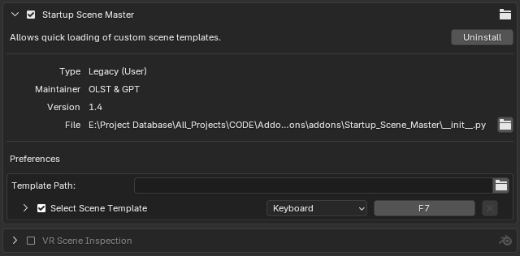
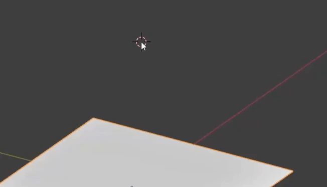

# Startup Scene Master

A simple but handy Blender addon to quickly load your custom startup `.blend` files.  
If you work on multiple types of projects, this saves you from setting up the default scene over and over again.

---

## 📷 Screenshots & Demo

**Addon preferences and hotkey:**

**How to open the template menu (press F7 by default):**

---

## 🔧 Features
- Store your scene templates in a separate folder
- Quickly load any template via hotkey (`F7` by default)
- Warns before overwriting the current scene
- Auto-loads the selected template after saving the current project

---

## 📁 How to Use
1. Install the addon via Preferences > Add-ons > Install.
2. Set the path to your `.blend` template folder in the addon preferences.
3. Press `F7` (by default) to open the template selector dialog.  
   You can reassign this shortcut in the keymap settings if needed.

---

**Author:** [OLST](https://github.com/OlstFlow) + GPT  
**Blender 4.3+**

---